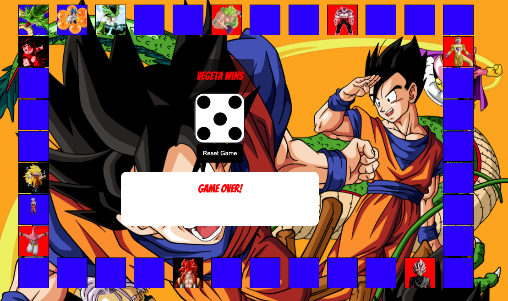

# Dragon-ballZ-Sayian-boardGame
Date: 2/12/2021 

By: Nick Williams 

[GitHub](https://github.com/NickWill24) | 
[LinkedIn](https://www.linkedin.com/in/nickwill24/)

[Live site](http://plain-apples.surge.sh/index.html)

[Trello](https://trello.com/b/nZm8aDho/game-project-management)
***

# Description
 the project is A board game inspire from Dragon ball z, where users can play against each other to find out the winner. 

# Technologies 
• HTML

• Javascript

• CSS

# How to get start stared:

• Open the the link to to the start the game.

•Their will be two player for this game.

•The player will have a choice of goku or vegeta.

•The first player to reach the finish spot on the board will win the game. 

# Future update:
• Add an extra booast 

• Add sound effects 

# Credits: 

Image Sources: 

[geekforgeeks](https://media.geeksforgeeks.org)

[Google](https://www.google.com)

[DuckDuckGo](https://duckduckgo.com)
